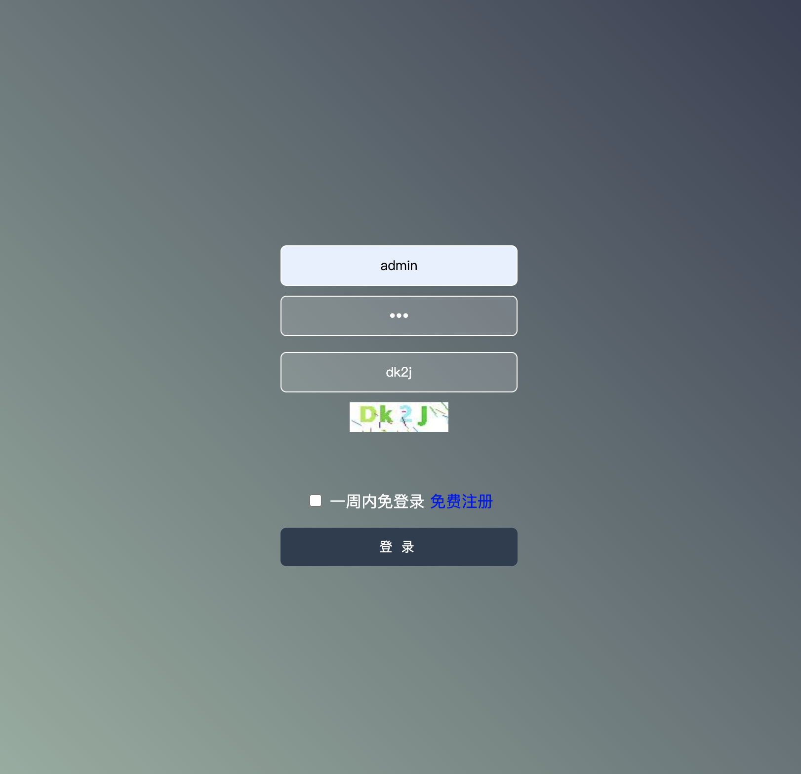
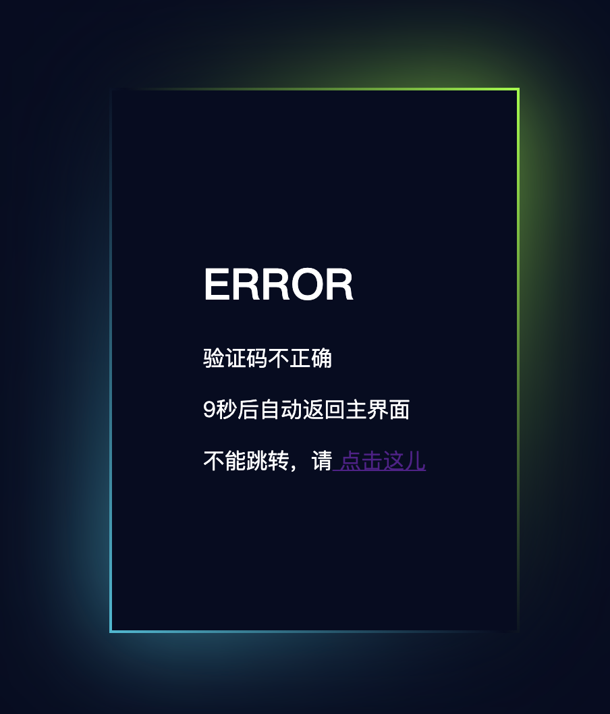
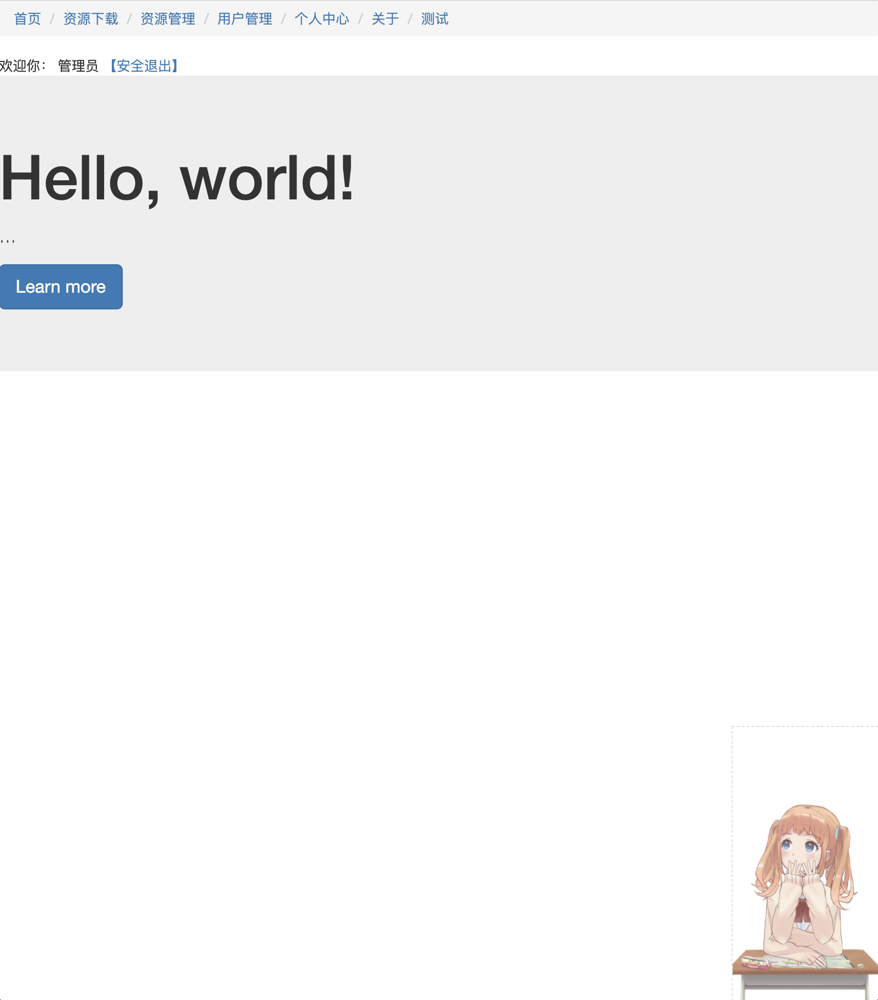
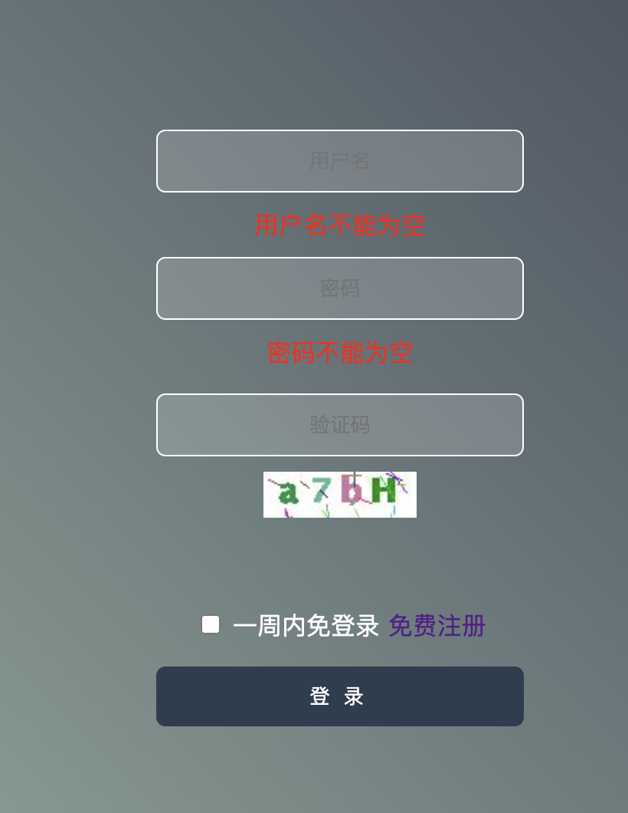
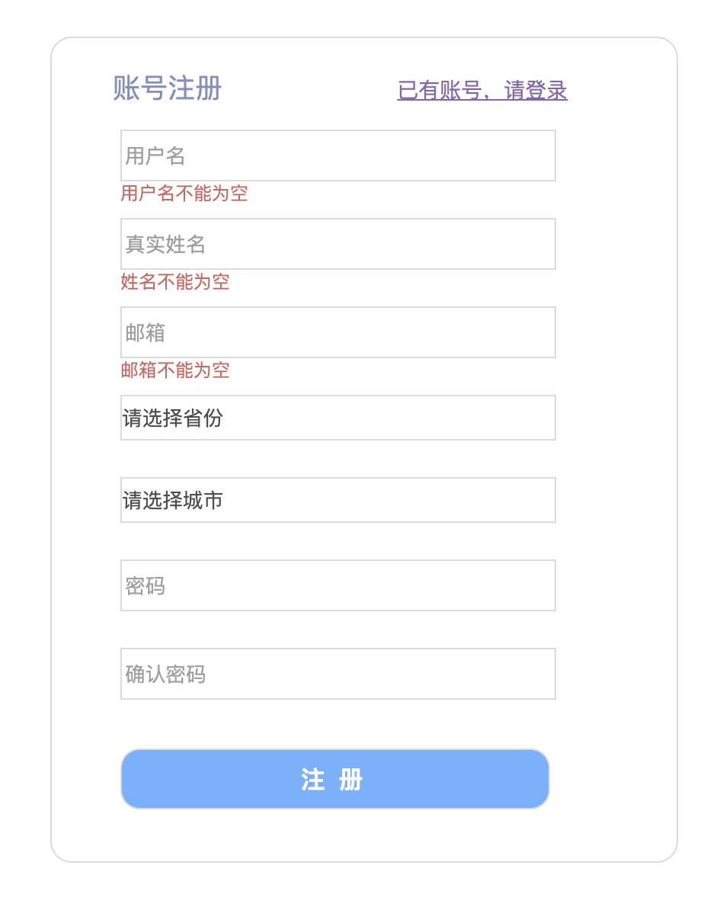

最后一次更新 2020/10/25

- 项目要求

  1. **视图**

  **（****1****）****用户登录界面**

  使用静态页面，文件名为login.html，包含的元素：用户名文本框、密码文本框、验证码输入文本框、验证码图片（动态随机的，由控制器createVerifyImage.do生成，以图片字节流形式返回给客户端）、登录按钮。

  要求：

  n 增加适当的样式，使页面美观

  n 鼠标移到验证码图片上，鼠标形状变为手状图标，显示提示信息“看不清，换一个”，点击后可以即时更换一张图片

  n 样式文件style.css存放在webroot的css目录中

  n 脚本文件login.js存放在webroot下的js目录中

  n 页面中所需的图片资源存放在webroot下的images目录中

  n 点击登录按钮后，以post方式将请求发送给控制器login.do

  

  

  2.在第一次作业的基础上，增加以下功能：

  （1）实现一周以内免登录功能

  （2）实现用户权限控制功能

  （3）对JDBC的连接关闭操作进行简单封装

  （4）数据库配置信息存放在jdbc.properties文件中

  登录时，用户如果勾选了“一周内免登录”，一旦用户登录成功以后，一周之内，用户访问main.jsp主页面，均可直接访问。

  修改main.jsp主页面的导航菜单

  

  3.在作业2的基础上，做以下的修改：

  login.html登录页面

  （1）增加数据校验功能，

  在用户名，密码，验证码文本框的blur事件中判断内容是否输入，在下面给出相应的提示。

  

  （2）登录验证改为ajax方式

  把登录验证方式从表单提交方式修改为ajax异步提交方式，登录失败，将登录错误信息显示在按钮下面，登录成功，直接重定向到main.jsp主页面。

  （3）增加注册页面

  点击“免费注册”，进入register.html页面

  

